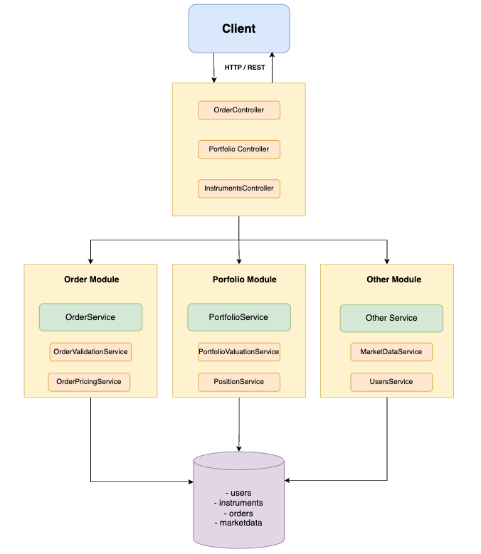

# 🏛️ Cocos Challenge - Trading API

> **Trading platform built with NestJS, TypeORM, and PostgreSQL**

Broker/trading system that handles portfolio management, order execution, and market data integration with financial calculations.

## 📋 Table of Contents

- [Setup & Installation](#-setup--installation)
- [Testing](#-testing)
- [Challenge Requirements](#-challenge-requirements)
- [System Design](#-system-design)
- [Core Features](#-core-features)
- [Architecture Overview](#-architecture-overview)
- [Business Logic](#-business-logic)
- [API Documentation](#-api-documentation)
- [Data Model](#-data-model)
- [Advanced Features](#-advanced-features)

---

## 🚀 Setup & Installation

1. **Clone the repository**
```bash
git clone <repository-url>
cd cocos-challenge
```

2. **Environment Setup**
```bash
# Copy the environment template
cp .env.example .env

# Edit .env with your database credentials
nano .env
```

3. **Install Dependencies**
```bash
make install
```

4. **Run the Application**
```bash
make run
```

The API will be available at:
- API Endpoints: `http://localhost:4000/api`
- Swagger Documentation: `http://localhost:4000/api/docs`

---

## 🧪 Testing

### API Testing
```bash
# Access Swagger Documentation
http://localhost:4000/api/docs

# Import Postman collection
cocos-challenge.postman_collection.json

# Or test manually
curl -X GET "http://localhost:4000/api/portfolio/1"
curl -X GET "http://localhost:4000/api/instruments/search?query=AAPL"
```

### Sample Test Scenarios
1. **Portfolio Valuation**: Get user portfolio with real-time calculations
2. **Order Execution**: Submit market and limit orders
3. **Cash Operations**: Deposit and withdraw funds
4. **Order Cancellation**: Cancel pending limit orders
5. **Search Functionality**: Find instruments by ticker or name

---

## 🎯 Challenge Requirements

### Required Features ✅
1. **Portfolio Endpoint**: Get user's total account value, available cash, and asset positions with quantities, monetary values, and returns
2. **Asset Search**: Search instruments by ticker and/or name within the market
3. **Order Submission**: Send buy/sell orders supporting MARKET and LIMIT types
4. **Order Management**: Handle order states (NEW, FILLED, REJECTED, CANCELLED)

### Optional Features ✅
- ✅ Postman collection provided
- ✅ Swagger documentation
- ✅ REST Client examples included
- ✅ Docker containerization

---

### System Design



## 🚀 Core Features

### 📊 Portfolio Management
```typescript
GET /api/portfolio/:userId
```
- **Real-time portfolio valuation** with current market prices
- **Available cash calculation** based on all trading activity
- **Position tracking** with weighted average cost methodology
- **Performance metrics**: Daily returns and total returns
- **Portfolio-weighted returns** for overall performance

### 🔍 Instrument Search
```typescript
GET /api/instruments/search?query=AAPL
GET /api/instruments
```
- **Flexible search** by ticker symbol or company name
- **Case-insensitive matching** with partial string support
- **Complete instrument catalog** access

### 📝 Order Management
```typescript
POST /api/orders              // Submit order
GET /api/orders/:userId       // Order history
PATCH /api/orders/:id/cancel  // Cancel order
```

**Order Types:**
- **MARKET**: Immediate execution at current price
- **LIMIT**: Execution when price target is reached

**Order Sides:**
- **BUY/SELL**: Securities trading
- **CASH_IN/CASH_OUT**: Deposit/withdrawal operations

**Order Specifications:**
- **By Shares**: `{ size: 100 }` - Exact number of shares
- **By Amount**: `{ amount: 5000 }` - Total peso investment (calculates max shares)

---

## 🏗️ Architecture Overview

### Microservices Design Pattern

```
📁 src/
├── modules/
│   ├── orders/
│   │   ├── validation/
│   │   │   └── order-validation.service.ts         # Business validation logic
│   │   ├── pricing/
│   │   │   └── order-pricing.service.ts            # Price calculations
│   │   ├── orders.controller.ts                    # API endpoints
│   │   ├── orders.module.ts                        # Module configuration
│   │   ├── orders.service.ts                       # Main orchestration
│   │   └── orders.service.spec.ts                  # Unit tests
│   │
│   ├── portfolio/
│   │   ├── calculator/
│   │   │   ├── position-calculator.service.ts      # Position calculations
│   │   │   └── position-calculator.service.spec.ts
│   │   ├── valuation/
│   │   │   ├── portfolio-valuation.service.ts      # Returns and valuations
│   │   │   └── portfolio-valuation.service.spec.ts
│   │   ├── portfolio.controller.ts                 # API endpoints
│   │   ├── portfolio.module.ts                     # Module configuration
│   │   ├── portfolio.service.ts                    # Portfolio orchestration
│   │   └── portfolio.service.spec.ts               # Unit tests
│   │
│   ├── instruments/
│   │   ├── instruments.controller.ts
│   │   ├── instruments.module.ts
│   │   ├── instruments.service.ts
│   │   └── instruments.service.spec.ts
│   │
│   ├── marketdata/
│   │   ├── marketdata.module.ts
│   │   ├── marketdata.service.ts
│   │   └── marketdata.service.spec.ts
│   │
│   └── users/
│       ├── users.module.ts
│       ├── users.service.ts
│       └── users.service.spec.ts
│
├── entities/
│   ├── index.ts
│   ├── instrument.entity.ts
│   ├── marketdata.entity.ts
│   ├── order.entity.ts
│   └── user.entity.ts
│
├── dtos/
│   ├── create-order.dto.ts
│   ├── instrument-search.dto.ts
│   ├── order-response.dto.ts
│   └── portfolio-response.dto.ts
│
├── database/
│   └── database.module.ts
│
├── app.module.ts
└── main.ts
```

### Benefits of Refactored Architecture
- **Separation of Concerns**: Each service has a single responsibility
- **Testability**: Smaller, focused units for unit testing
- **Maintainability**: Clear code organization and logic separation
- **Scalability**: Easy to extend with new features
- **Reusability**: Services can be used independently

---

## 💼 Business Logic

### Portfolio Calculation Logic

**1. Position Tracking (Weighted Average Cost Method)**
```typescript
// Example: User buys at different prices
Buy 100 @ $50 = $5,000    // Position: 100 shares @ $50.00 avg
Buy 200 @ $60 = $12,000   // Position: 300 shares @ $56.67 avg
Buy 100 @ $70 = $7,000    // Position: 400 shares @ $60.00 avg

// Calculation Formula:
// newTotalCost = position.totalCost + (order.size * order.price)
// newQuantity = position.quantity + order.size
// avgPrice = newTotalCost / newQuantity

// Step by step:
// Step 1: 100 * $50 = $5,000 / 100 = $50.00 avg
// Step 2: ($5,000 + $12,000) / 300 = $56.67 avg
// Step 3: ($17,000 + $7,000) / 400 = $60.00 avg

// This method recalculates the average price with each purchase,
// providing a weighted average cost basis for the entire position.
```

**2. Available Cash Calculation**
```typescript
Cash = Initial_Deposits - Total_Purchases + Total_Sales - Total_Withdrawals
```

**3. Portfolio Returns**
```typescript
// Daily Return: Based on previous close vs current close
dailyReturn = ((currentPrice - previousClose) / previousClose) * 100

// Total Return: Based on average cost vs current price  
totalReturn = ((currentPrice - averageCost) / averageCost) * 100

```

### Order Validation Rules

**Buy Orders:**
- ✅ User has sufficient cash: `orderCost ≤ availableCash`
- ✅ Valid instrument exists
- ✅ Price provided for LIMIT orders

**Sell Orders:**
- ✅ User owns sufficient shares: `orderSize ≤ availableShares`
- ✅ Position exists for the instrument

**Cash Operations:**
- ✅ CASH_IN: Always approved (deposits)
- ✅ CASH_OUT: Sufficient cash available

---

## 📡 API Documentation

The API is documented using Swagger/OpenAPI. You can access the interactive documentation at:
```http
http://localhost:4000/api/docs
```

### Portfolio Endpoint
```http
GET /api/portfolio/1

Response:
{
  "totalValue": 125000.50,
  "availableCash": 25000.00,
  "dailyReturn": 2.35,
  "positions": [
    {
      "instrumentId": 1,
      "ticker": "AAPL",
      "name": "Apple Inc.",
      "quantity": 100,
      "totalValue": 15000.00,
      "dailyReturn": 1.25,
      "totalReturn": 8.75,
      "avgPrice": 138.25
    }
  ]
}
```

### Order Submission
```http
POST /api/orders
Content-Type: application/json

// Market Order by Shares
{
  "userId": 1,
  "instrumentId": 1,
  "side": "BUY",
  "type": "MARKET",
  "size": 100
}

// Limit Order by Amount
{
  "userId": 1,
  "instrumentId": 1,
  "side": "BUY", 
  "type": "LIMIT",
  "amount": 5000,
  "price": 150.00
}

// Cash Deposit
{
  "userId": 1,
  "instrumentId": 66,
  "side": "CASH_IN",
  "type": "MARKET",
  "size": 10000
}
```

### Search Instruments
```http
GET /api/instruments/search?query=AAPL
GET /api/instruments/search?query=Apple
GET /api/instruments
```

---

## 🗄️ Data Model

### Core Entities

**Users**
```sql
id, email, accountNumber
```

**Instruments** 
```sql
id, ticker, name, type
-- Types: Stock, ETF, MONEDA (ARS currency)
```

**Orders**
```sql
id, userId, instrumentId, side, type, size, price, status, datetime
-- Sides: BUY, SELL, CASH_IN, CASH_OUT
-- Types: MARKET, LIMIT  
-- Status: NEW, FILLED, REJECTED, CANCELLED
```

**MarketData**
```sql
id, instrumentId, open, high, low, close, previousClose, date
-- Used for real-time pricing and daily return calculations
```

### Entity Relationships
- User → Orders (1:N)
- Instrument → Orders (1:N) 
- Instrument → MarketData (1:N)

---

## ⭐ Advanced Features

### 🧮 Financial Mathematics
- **Weighted Average Cost Calculation**: Professional average cost basis tracking
- **Portfolio Weighted Returns**: Accurate portfolio-level performance metrics

### 🏛️ Enterprise Architecture
- **Microservices Pattern**: Separated validation, pricing, and calculation services
- **Clean Architecture**: Clear separation of concerns and dependencies
- **Comprehensive Logging**: Detailed audit trail for financial operations

### 🔧 Developer Experience
- **Swagger Documentation**: Complete API documentation with examples
- **Docker Setup**: One-command environment setup
- **Postman Collection**: Ready-to-use API testing collection

---

## 🔮 Future Enhancements

### Authentication & Security
- JWT-based authentication
- Role-based access control
- API rate limiting

### Advanced Order Types
- Stop-loss orders
- Take-profit orders

### Analytics & Reporting
- Historical performance charts
- Risk metrics

### Real-time Features
- WebSocket market data streaming
- Real-time order book
- Price alerts and notifications